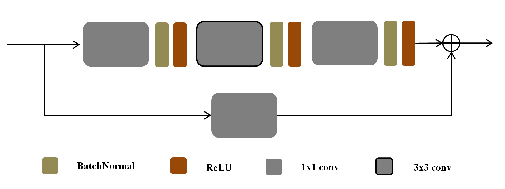

# Deep_learning_practice
## 实现：
### 1、Caffe使用prototxt解析model/Caffe只使用model解析，可视化权值参数（caffemodel_load）（已完成）
> 
### 2、Effective Block
>
2.1 Resnet Block
>

> 
2.2 DenseBlock
> 
2.3 Inception_V1-4_Block
> 
2.4 MobilenetBlock
> 
2.5 ResnextBlock
> 
2.6 SEBlock (channel attention block)
> 
2.7 SABlock (self-attention block)
> 
2.8 ShufflenetBlock
> 
2.9 SqueezeBlock
> 
2.10 CBAMBlock

## 3、Normalition算法实现
> 
3.1 Batch Normalization (BN)
> 
3.2 Layer Normalization (LN)
> 
3.3 Instance Normalization (IN)
> 
3.4 Group Normalization (GN)
## 4、h5tojson
>
将h5的groundtruth标注文件转为json的格式
## 5、Evaluation method
>
机器学习用到的一些评价以及损失函数方法，手写实现
> 
5.1 IOU
> 
5.2 AUC

